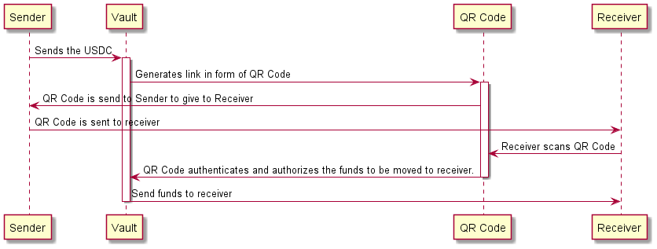

# RedPacket POC

With the voting to conduct the red packet app to pass in DrafDAO, a POC will be conducted at this repository to see if it can be done. This POC will contain a simple website that will depict the simple plantuml flow. 

High Level Architecture
-------------------------
1) Frontend Single Page Appliation
    a) Sender
    b) Receiver
2) Smart Contract Vault

POC Assumptions
-------------------------
1) One EVM Chain
2) USDC

The flow of the Red Packet POC system is as below:-
